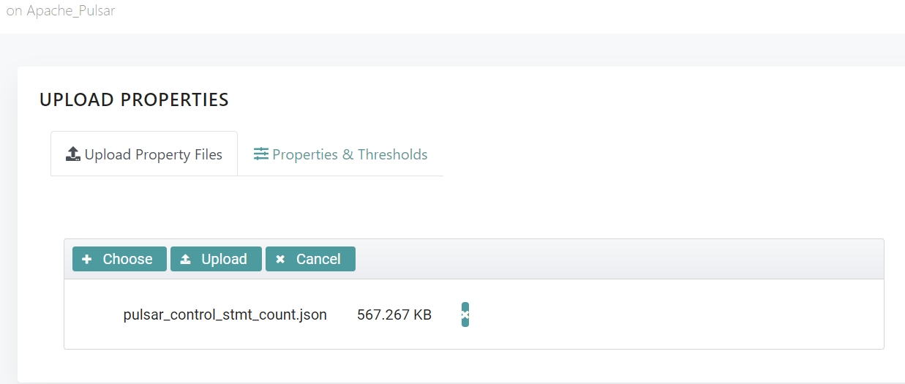
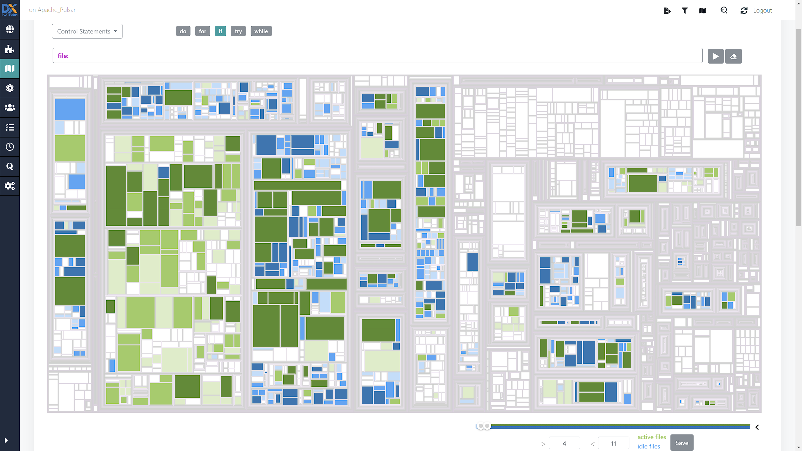
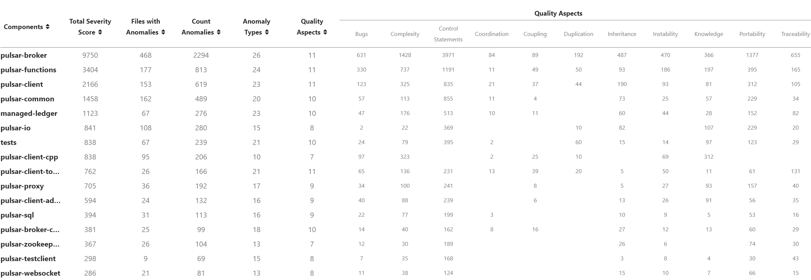
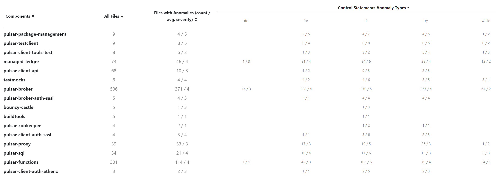

# DxPlatform Control Statements Counter

This is a tool which is able to count the main control statements (if, for, while, try, do) in java files located in a software project. 
This could be useful when you want to see which files overuse control statements, based on the size of the file, and the count of control statements.

# Motivation

This project was made as a tool to enrich DxPlatform's data about the analysed project.
It provides a properties file which contains the number of each mentioned control statement in each java project file. After, this results file can be imported in DxPlatform.

# Installation

## From Github
To install this tool, please download from the [latest release](https://github.com/fmatheiu98/DxPlatform-Control-Statements-Counter/releases/tag/v1.0.0) from Github, the `control_statements_counter.zip` archive and unzip it to your preferred location. The contents of the archive are:
* `control_stmt_counter.jar` - the executable jar file
* `config` - a folder which contains the configuration file, `config.txt`
* `docker-compose.yml` - a configuration file for running the docker container easily

## From Code
You can clone this repository with the following command:
```
git clone https://github.com/fmatheiu98/DxPlatform-Control-Statements-Counter.git
```
Then, inside the repository you can find a two files called `run.sh` and `run.bat`. You can invoke one of the files (depending if you are on Windows or Unix) from a terminal in order to create an executable jar file.

Firstly, you must have Java-JDK installed on your computer.
If you have it installed, then if you run the command `java -version` it should return the version of JDK present on your computer.
If you don't have it installed, you can get it from [here](https://www.oracle.com/ro/java/technologies/javase-downloads.html).

To invoke `run.sh`/`run.bat` you must also have **Maven** installed on your computer. To check if you have it installed, you can run the command `mvn -v` and it should display the version of Maven.
If you don't have it installed, you can download it from [here](https://maven.apache.org/download.cgi) and install it following the instructions from [here](https://maven.apache.org/install.html).

After you run `run.sh`/`run.bat`, it should create the executable jar that you can run by following the instructions below.

# Configuration
In order to run this tool on a project, you need to edit the configuration file (`config.txt`) located in the `config` folder.
There you need to **specify the ID** for the analysed project and the **root folder** of the project's sources.

# How to run it?
## From command line
You need to have Java JRE/JDK in order to run the executable jar file. You can follow the instructions on how to install a JRE/JDK from **Installation**.

You can run the tool with the following command:
```
java -jar control_stmt_counter.jar config/config.txt
```

## From Docker
This tool is also stored in a Docker image available on DockerHub. You can find it [here](https://hub.docker.com/repository/docker/fmatheiu98/control-statements-counter).

Firstly, you need to have Docker Desktop installed on your computer.
To check if you have it installed, you can run the command `docker -v` and it should return the version of Docker present on your computer.
If you don't have it installed, you can get it from [here](https://www.docker.com/products/docker-desktop).
You also need to have a directory called `config` which contains a `config.txt` file in the directory where you execute the commands from below.

Then you need to modify `docker-compose.yml` and change the last volume by adding the path to the project root folder. It should look like this:
```
version: "3.8"

services:
  control-statements-counter:
    image: fmatheiu98/control-statements-counter
    volumes:
    - ./config:/control_stmt_counter/config
    - ./:/control_stmt_counter
    - {path-to-project-root}:/project_root
```

Then you need to write **/project_root** at the baseFolderPath in the `config/config.txt`. It should look something like this:
```
projectId=pulsar
baseFolderPath=/project_root
```

To run the tool from the docker container, you need to be located in the project folder and execute:
```
docker-compose run control-statements-counter config/config.txt
```

If you don't want to use the docker-compose file, you can run the tool with the command (you need to change the current directory and the project root paths to match with your system):
```
docker run -v {current-directory path}/config:/control_stmt_counter/config -v {project_root_path}:/project_root -v {current-directory path}:/control_stmt_counter fmatheiu98/control-statements-counter config/config.txt
```

# Results
The tool creates a properties file (json) for the project in the format accepted by DxPlatform. The results file is named `{projectID}_control_stmt_count.json` and it is placed inside the project directory.
This file contains a list of json objects, each object representing an entry with a name (if, for, while, do, try), a category (Control Statements), a file path and a value for a java file from the project. The value represents the number of statements.

`{projectID}_control_stmt_count.json` should look like this:
```json
[ {
  "name" : "if",
  "category" : "Control Statements",
  "file" : "bouncy-castle/bc/src/main/java/org/apache/pulsar/bcloader/BouncyCastleLoader.java",
  "value" : 1
}, {
  "name" : "if",
  "category" : "Control Statements",
  "file" : "bouncy-castle/bcfips/src/main/java/org/apache/pulsar/bcloader/BouncyCastleFipsLoader.java",
  "value" : 1
}, {
  "name" : "for",
  "category" : "Control Statements",
  "file" : "bouncy-castle/bcfips-include-test/src/test/java/org/apache/pulsar/client/TlsProducerConsumerTest.java",
  "value" : 2
}, 
  ...
]
```
Now you can import this file into DxPlatform:


Then you can go look at the System Map and select the Control Statements category to see the results. It should look like this:

You can click on any of the five control statements to see which files contain or not contain them. The intensity of the colour tells if a file contain more or less control statements. 

The results are also visible in the Quality Model/Quality Dimension section after you restart DxPlatform.



# How it is made?
The tool is written in Java and uses the [Java Parser](https://javaparser.org/) library.
For each java file in the analysed project, the program generates an Abstract Syntax Tree which means a Java object representation of the code in that file.
Then that tree is traversed recursively and each node is verified. If that node is a statement, it can be one of the five mentioned control statements. Each mentioned statement has a counter which increments accordingly.
At the end, for each java file we write the number of each control statement in a JSON file, if that number is greater than 0.

# Credits
This project is made with the help of the [Java Parser](https://javaparser.org/) library.

# License
Licensed under the Apache License, Version 2.0: http://www.apache.org/licenses/LICENSE-2.0
